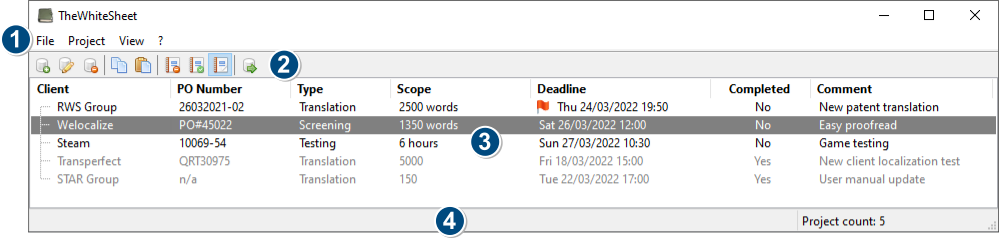
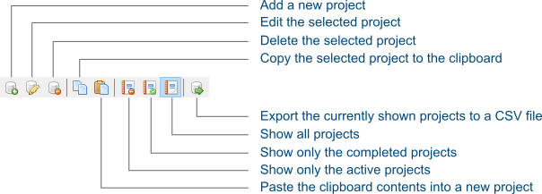
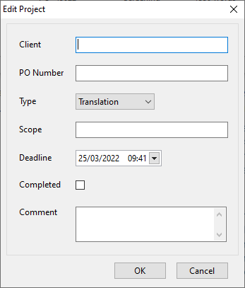
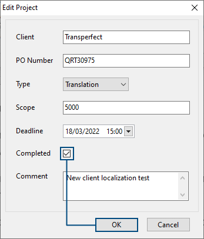
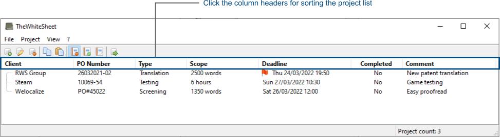

This section familiarizes you with the user interface and helps you set up your first project.

## User interface overview

The following screenshot present you with an overview of the user interface:

1. Program menu
    * File: Items for exporting the project list and for exiting the application. 
    * Project: Items for creating, editing and deleting projects.
    * View:  Items for changing the project list view, based on their completion status.
    * ?: Access this user manual and an option to show the application's About-dialog.
2. Toolbar
    * Buttons for quick access to select commonly used program features.
3. Project list
    * Table display of all projects, based on the active view. Clicking a column header sorts the projects.
4. Status bar
    * Shows program hints.
    * Displays the total number of projects in the active view.

## Toolbar

Using the buttons available on the toolbar, offers a convenient and quick way to work with the application. When you move the mouse cursor over a button, the status bar displays a hint regarding its functionality. You can find an overview of what each toolbar button does, in the following illustration:

## Create a new project

To create a new project, select *Project* &rarr; *Add* from the program menu, press <kbd>Insert</kbd>  on the keyboard or click its associated toolbar button. This displays the *Edit project* dialog:

Start out by entering the name of your *Client*, select the project *Type* and the deadline. 

It's recommended to also enter the *Scope* of the project. For example how many words need to be translated or proofread. This helps you keep track of how busy you are. 

If you already received a purchase order for the project from your customer, then add it to the *PO Number* field. A handy reference for when its time to invoice completed projects.

Keep the *Completed* checkbox unchecked, since this is a new project. You can check the checkbox upon project completion. 

In the *Comment* box, you can enter an optional project comment. 

Once you completed entering the project's information, click the *OK* button.

## Mark a project as completed

When you completed a project, you can mark it as such. To edit a project, click on it in the project list to select it. To edit the selected project, select *Project* &rarr;  *Edit* from the program menu, press <kbd>Enter</kbd> on the keyboard or double-click the selected row in the project list.

This brings up the *Edit project* dialog for the project. To mark the project as completed, check the *Completed* checkbox and click the *OK* button:

## Sorting projects

By clicking on the column header in the project list, you can sort the projects based on that column, in ascending order. Clicking the same column header again, you can change the sorting order. By default, the project list is sorted by deadline.

 

## Changing the view

Three different views exist for further filtering the project list:

1. All active (non-completed) projects. Keyboard shortcut <kbd>F4</kbd>.
2. All completed projects. Keyboard shortcut <kbd>F5</kbd>.
3. All projects. Keyboard shortcut <kbd>F6</kbd>.

You can use the *View* menu, associated toolbar buttons or the keyboard shortcuts to switch between the different views.

While actively working on your projects during the day, the view that shows the active projects is the recommended view.

When it's invoicing time, typically once a month or so, you can switch to the view showing only the completed projects. Next, sort by *Client* name and then create your invoice for the completed projects for a particular customer. You can even [export](#export-project-list) the list of completed projects, for further processing and potentially automating the invoice generation.

## Export the project list

## Delete a project

## User settings
