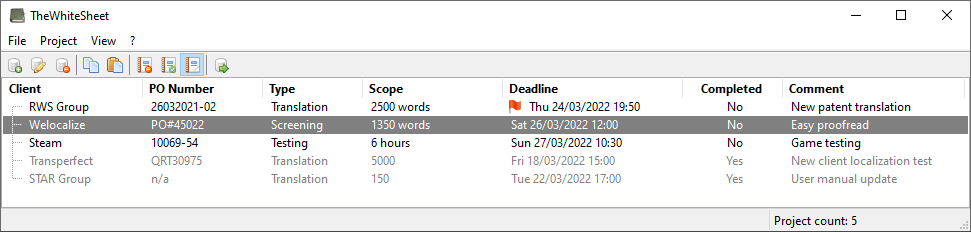

**TheWhiteSheet** is a project management tool specifically developed for professional translators:

## Background

As a freelancer offering localization services, you deal which a high amount of projects that often tend to be small in scope. It's not uncommon to deliver multiple projects in a single workday. Commonly available project management tools don't cut it. These assume a low frequency of projects that each lasts several days, if not weeks. You can't even set a time, in addition to the date for the project deadline. 

Consequently, staying on top of your project load and keeping a clear overview poses quite the challenge. You'll probably start out keeping track of everything on a piece of paper. Cross out delivered projects, use color coding for priority. Somewhat okay, but then the end of the month rolls by and it's time to generate invoices. Wait..which projects did I complete for client X again? Sound familiar?

**TheWhiteSheet** to the rescue:

* You can enter and track all your projects in a table.
* Specify not only a date, but also a time for a project's deadline.
* Visual indicators to remind you of a soon-to-expire project deadline.
* Mark projects as active or complete, with different views to show/hide projects based on their completion status.
* Column sorting to organize your projects by client, type, deadline and completion status.
* Export your project list to a CSV formatted file, for further processing in a spreadsheet program such as  Microsoft Excel and LibreOffice Calc.

With the help of **TheWhiteSheet**, you'll stay on top of your project load and save yourself time doing your administration. More time and less stress translates into increased productivity and lower stress levels. Best of all, **TheWhiteSheet** is a free and open source tool.

## Installation

You can download a Windows 7/8/10/11 installer from the [Releases page](https://github.com/kruizer23/thewhitesheet/releases). Run the installer by double-clicking the downloaded `.exe` file. Afterwards, you can find a shortcut to **TheWhiteSheet** in your start menu to open the application.

For additional information on using TheWhiteSheet, either play around and experiment with it or continue reading in the [getting started](getting_started.md) section.

## System requirements

* 64-bit Windows 7, 8, 10 or 11
* 2048 MB of RAM
* 60 MB of free disk space
* 1024x768 screen resolution or higher

